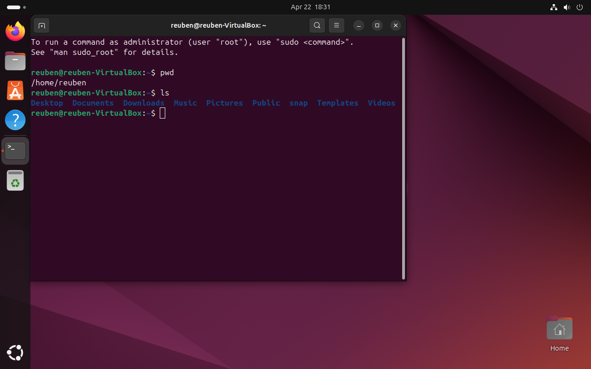
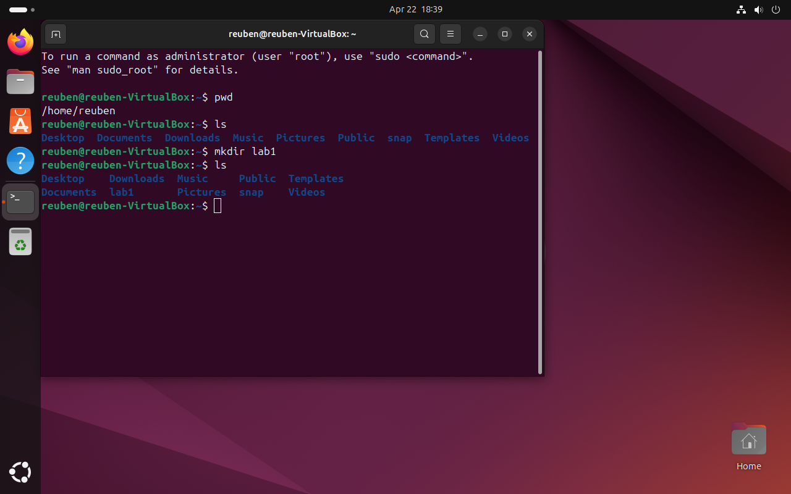
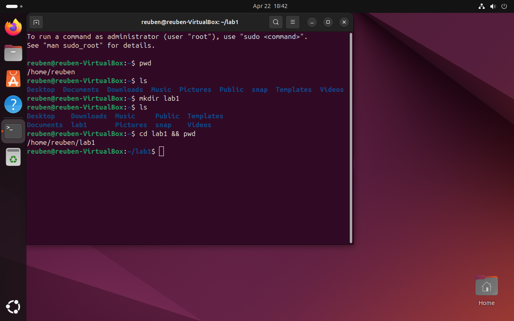
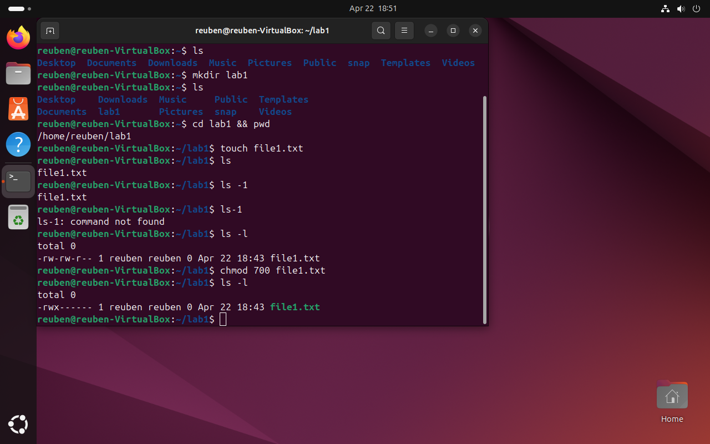
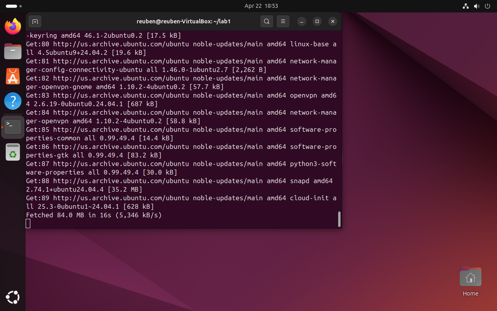

# 🧪 Linux (Ubuntu) Setup & Basic Administration Lab

## 📌 Objective
The purpose of this lab was to install and configure a Linux environment using Ubuntu and perform basic system administration tasks through the command line.

---

## 🛠️ Tools Used
- Oracle VM VirtualBox  
- Ubuntu (Linux OS)

---

## ⚙️ Lab Setup
- Created a virtual machine using VirtualBox  
- Installed Ubuntu using ISO image  
- Configured user account and system settings  

---

## 🔍 Steps Performed

### 1. Verified current directory
Used `pwd` to confirm current working directory.

---

### 2. Listed directory contents
Used `ls` to view existing files and directories.

---

### 3. Created a new directory
Used `mkdir lab1` to create a working folder.

---

### 4. Navigated and created a file
Used `cd lab1` and `touch file1.txt` to create a file.

---

### 5. Checked and modified permissions
Used `ls -l` to view permissions and `chmod 700 file1.txt` to restrict access.

---

### 6. Updated system packages
Used `sudo apt update && sudo apt upgrade -y` to update the system.

---

## 🧠 What I Learned
- How to navigate the Linux file system using command-line tools  
- How to create and manage files and directories  
- Understanding file permissions and access control  
- How to update and maintain a Linux system  
- Importance of command-line usage in system administration  

---

## ⚠️ Troubleshooting / Errors Encountered
- Initially used `ls -1` instead of `ls -l`, which did not display file permissions.  
- Corrected the command to properly view detailed file information.
