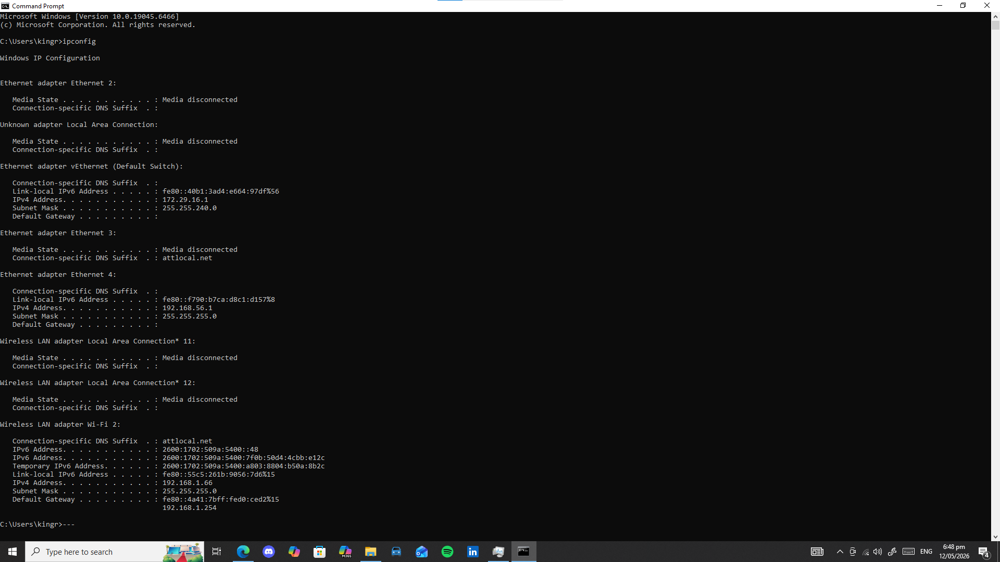
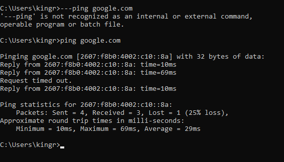
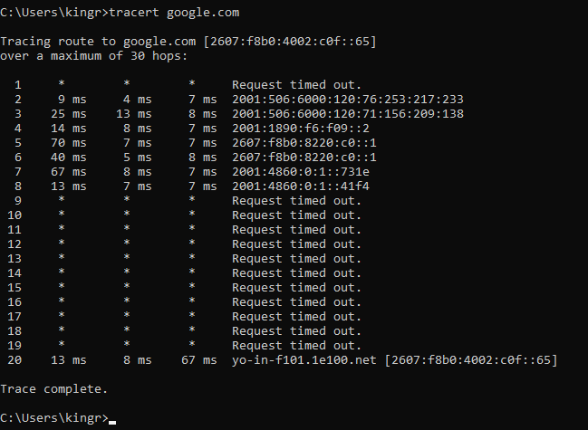
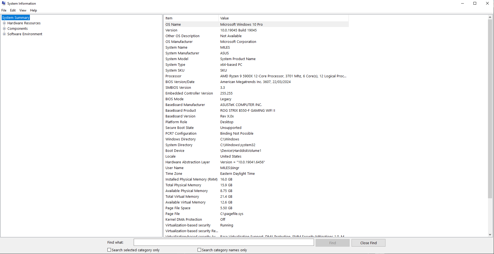
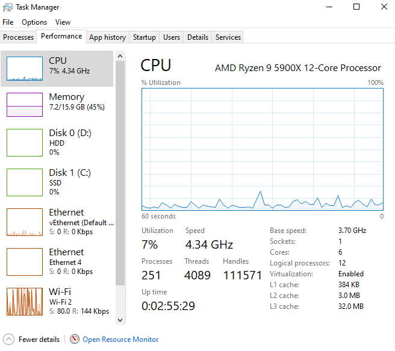
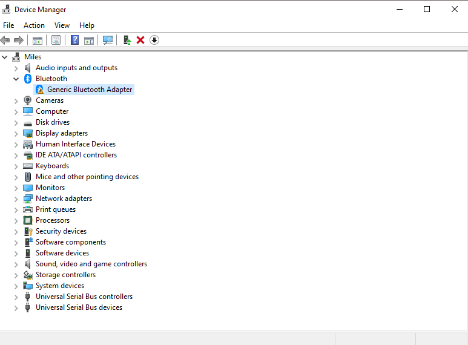
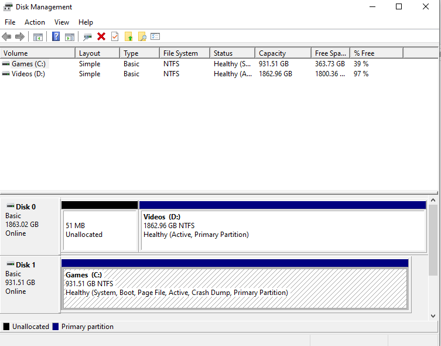

# Windows System Administration & Troubleshooting Lab

## Objective
The purpose of this lab was to gain hands-on experience with basic Windows system administration and troubleshooting tools commonly used in IT support environments. This lab focused on networking commands, system monitoring, hardware management, and system information analysis.

---

## Tools & Technologies Used
- Microsoft Windows
- Command Prompt
- Task Manager
- Device Manager
- Disk Management
- System Information (msinfo32)

---

## Commands Used

```cmd
ipconfig
```

```cmd
ping google.com
```

```cmd
tracert google.com
```

---

## Tasks Performed

### 1. Checked Network Configuration
- Used `ipconfig` to view:
  - IPv4 Address
  - Subnet Mask
  - Default Gateway

### 2. Tested Network Connectivity
- Used `ping google.com` to test internet connectivity and DNS resolution
- Observed successful replies and a temporary request timeout

### 3. Traced Network Route
- Used `tracert google.com` to analyze how traffic travels across networks to reach a destination

### 4. Viewed System Information
- Opened `msinfo32` to review:
  - Processor information
  - Installed RAM
  - BIOS version
  - Operating System details

### 5. Monitored System Performance
- Used Task Manager to monitor:
  - CPU usage
  - Memory usage
  - Disk activity
  - Network activity

### 6. Inspected Hardware Devices
- Opened Device Manager to review installed hardware and drivers
- Identified a warning icon on a Generic Bluetooth Adapter device

### 7. Reviewed Disk Layout
- Used Disk Management to inspect system partitions and storage devices

---

## Screenshots

### ipconfig Output


### Ping Test


### Tracert Output


### System Information


### Task Manager Performance Tab


### Device Manager


### Disk Management


---

## What I Learned
- Basic Windows networking commands and troubleshooting techniques
- How to identify network configuration information
- How IT support uses Task Manager and Device Manager for troubleshooting
- How to inspect hardware devices, drivers, and storage layouts
- How to analyze system performance and connectivity issues

---

## Outcome
This lab provided foundational hands-on experience with Windows troubleshooting and system administration tools commonly used in Help Desk and IT Support roles.
